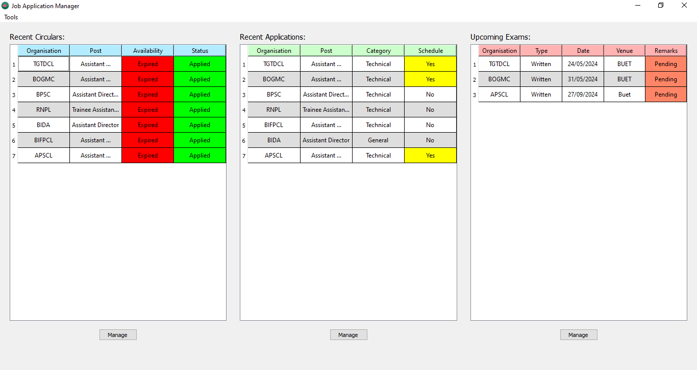
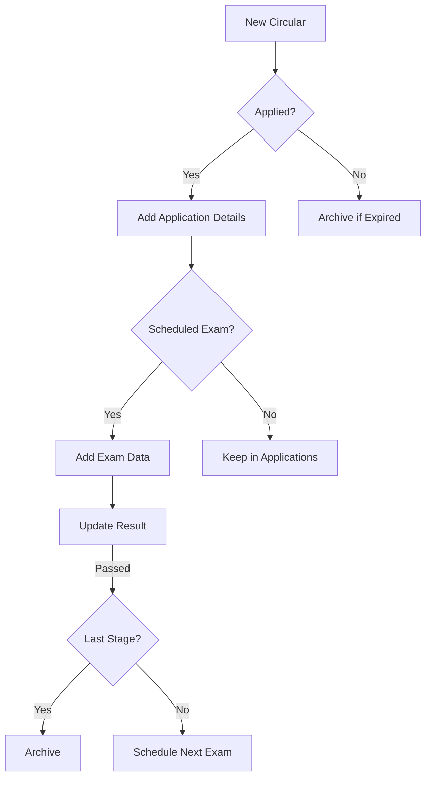
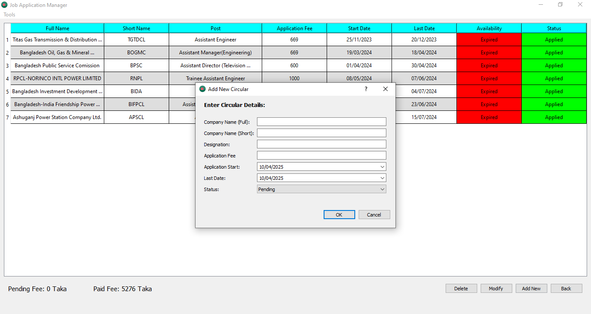
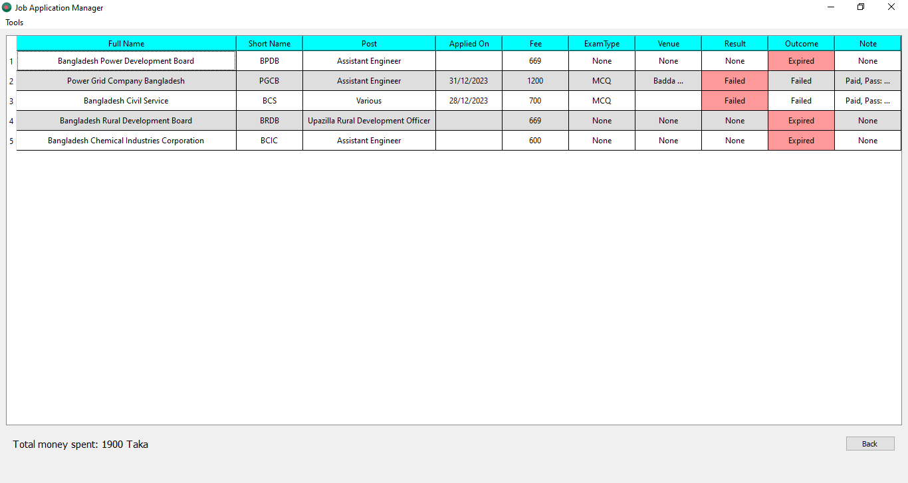
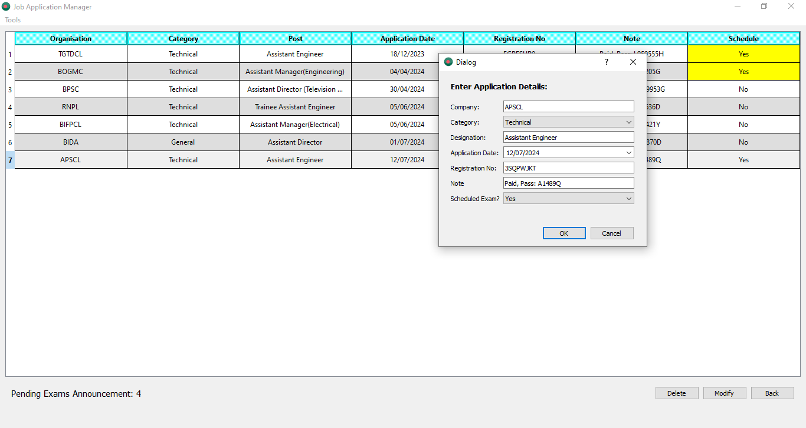

# 📋 Job Application Manager (PyQt5)



A **desktop application** for managing Bangladeshi government job applications, exams, and results with SQLite backend.

[](https://github.com/salmanshovon/Job_Application_Manager-PyQt5)
[](https://pypi.org/project/PyQt5/)
[](https://sqlite.org)

## 🌟 Features
- **Circular Management**  
  ✔️ Add/update job circulars (Organization, Post, Dates, Fee)  
  ✔️ Auto-archive expired pending circulars  

- **Application Tracking**  
  ✔️ Record registration numbers, categories, notes  
  ✔️ Mark exam eligibility  

- **Exam Workflow**  
  ✔️ Schedule exams (MCQ/Written/Viva)  
  ✔️ Update results with multi-stage support  
  ✔️ Auto-promote to next stage or archive  

- **Data Persistence**  
  ✔️ SQLite database (`info.db`)  
  ✔️ Export/import functionality  

## 🚀 Quick Start
1. **Clone the repository**:
   ```bash
   git clone https://github.com/salmanshovon/Job_Application_Manager-PyQt5.git
   cd Job_Application_Manager-PyQt5
   ```

2. **Install dependencies**:
   ```bash
   pip install -r requirements.txt
   ```

3. **Run the application**:
   ```bash
   python src/main.py
   ```


## 📖 Workflow Overview


## 🖼️ Screenshots
| Circulars View | Archive | Exam Scheduling |
|----------------|--------------|-----------------|
|  |  |  |

## 📝 Usage Guide
1. **Add Circulars**:
   - Fill organization/post details in "Circulars" tab
   - Set status (Applied/Pending)

2. **Track Applications**:
   - For "Applied" circulars, add:
     - Registration number
     - Category (General/Technical)
     - Exam eligibility

3. **Manage Exams**:
   - Update exam dates/venues
   - Modify results (Pass/Fail)
   - Handle multi-stage exams

4. **Access Archive**:
   - Menubar: `Tools > Archive`

## 📜 License
MIT License - See [LICENSE](./LICENSE)

## 📬 Contact
**Salman Mahmood Shovon**   
📧 salman.eee@yahoo.com  
💼 [GitHub Profile](https://github.com/salmanshovon)
